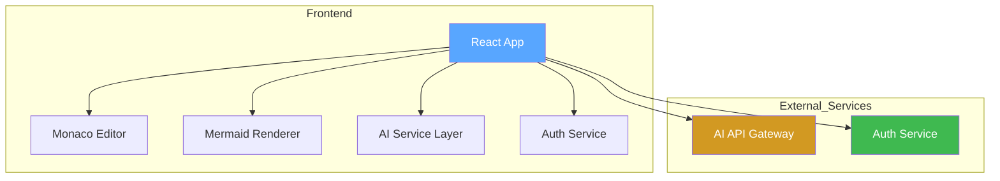
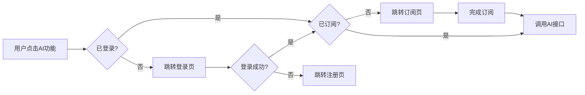

# MermaidFlow - 技术架构文档

## 1. 架构设计



## 2. 技术栈

- **前端框架**：React@18 + TypeScript
- **构建工具**：Vite
- **样式方案**：Tailwind CSS@3
- **代码编辑器**：Monaco Editor
- **图表渲染**：Mermaid.js
- **AI 集成**：调用后端 AI API（预留接口）
- **图标库**：Lucide React
- **状态管理**：React Context + useReducer
- **路由管理**：React Router@6

## 3. 路由定义

| 路由 | 页面名称 | 功能描述 |
|------|----------|----------|
| `/` | 编辑器页面 | 主编辑界面 |
| `/login` | 登录页面 | 用户登录 |
| `/register` | 注册页面 | 用户注册 |
| `/subscribe` | 订阅页面 | 套餐管理 |

## 4. 核心组件结构

```
src/
├── components/
│   ├── Editor/
│   │   ├── CodeEditor.tsx      # Monaco 编辑器封装
│   │   ├── Preview.tsx          # Mermaid 预览区
│   │   └── StatusBar.tsx       # 底部状态栏
│   ├── AI/
│   │   ├── AIGeneratePanel.tsx # AI 生成面板
│   │   └── AIFixPanel.tsx      # AI 修复面板
│   ├── Auth/
│   │   ├── LoginForm.tsx
│   │   └── RegisterForm.tsx
│   ├── Layout/
│   │   ├── Header.tsx
│   │   └── Sidebar.tsx
│   └── Subscription/
│       └── PricingCard.tsx
├── contexts/
│   ├── AuthContext.tsx          # 认证状态管理
│   └── EditorContext.tsx       # 编辑器状态管理
├── hooks/
│   ├── useMermaid.ts            # Mermaid 渲染逻辑
│   └── useAI.ts                 # AI API 调用
├── pages/
│   ├── EditorPage.tsx
│   ├── LoginPage.tsx
│   ├── RegisterPage.tsx
│   └── SubscribePage.tsx
├── services/
│   ├── api.ts                   # API 请求封装
│   └── mermaid.ts               # Mermaid 配置
└── types/
    └── index.ts                 # TypeScript 类型定义
```

## 5. API 接口设计（前端视角）

### 5.1 认证接口

```typescript
// POST /api/auth/register
interface RegisterRequest {
  email: string;
  password: string;
}

// POST /api/auth/login
interface LoginRequest {
  email: string;
  password: string;
}

interface AuthResponse {
  token: string;
  user: {
    id: string;
    email: string;
    isSubscribed: boolean;
  };
}
```

### 5.2 AI 接口

```typescript
// POST /api/ai/generate
interface GenerateRequest {
  description: string;
}

interface GenerateResponse {
  mermaidCode: string;
}

// POST /api/ai/fix
interface FixRequest {
  mermaidCode: string;
  error: string;
}

interface FixResponse {
  fixedCode: string;
}
```

### 5.3 订阅接口

```typescript
// GET /api/subscription
interface SubscriptionResponse {
  plan: 'free' | 'pro';
  expiresAt: string | null;
}

// POST /api/subscription/create
interface CreateSubscriptionRequest {
  plan: 'pro';
  paymentMethod: string;
}
```

## 6. 数据模型

### 6.1 用户数据

```typescript
interface User {
  id: string;
  email: string;
  passwordHash: string;
  isSubscribed: boolean;
  subscriptionPlan: 'free' | 'pro';
  subscriptionExpiresAt: Date | null;
  createdAt: Date;
}
```

### 6.2 编辑器状态

```typescript
interface EditorState {
  code: string;
  error: string | null;
  isRendering: boolean;
  lastSaved: Date | null;
}
```

## 7. Mermaid 配置

```typescript
const mermaidConfig = {
  startOnLoad: false,
  theme: 'dark',
  themeVariables: {
    primaryColor: '#58A6FF',
    primaryTextColor: '#fff',
    primaryBorderColor: '#58A6FF',
    lineColor: '#8B949E',
    secondaryColor: '#161B22',
    tertiaryColor: '#21262D',
  },
  flowchart: {
    useMaxWidth: true,
    htmlLabels: true,
  },
  sequence: {
    useMaxWidth: true,
  },
};
```

## 8. AI 功能设计

### 8.1 AI 生成提示词模板

```
你是一个 Mermaid 图表专家。请根据用户的描述生成 Mermaid 代码。

用户描述：{userDescription}

要求：
1. 只返回 Mermaid 代码，不要包含任何解释
2. 使用正确的 Mermaid 语法
3. 支持的图表类型：flowchart, sequenceDiagram, classDiagram, stateDiagram, erDiagram, gantt

请生成代码：
```

### 8.2 AI 修复提示词模板

```
你是一个 Mermaid 图表专家。用户的 Mermaid 代码有语法错误，请修复。

原始代码：
{originalCode}

错误信息：
{errorMessage}

要求：
1. 只返回修复后的 Mermaid 代码
2. 保持图表的核心逻辑不变
3. 修正所有语法错误

修复后的代码：
```

## 9. 认证与订阅流程



## 10. 安全考虑

- 用户密码使用 bcrypt 加密存储
- API 请求使用 JWT Token 认证
- AI 接口调用需验证用户订阅状态
- 敏感操作需二次验证
